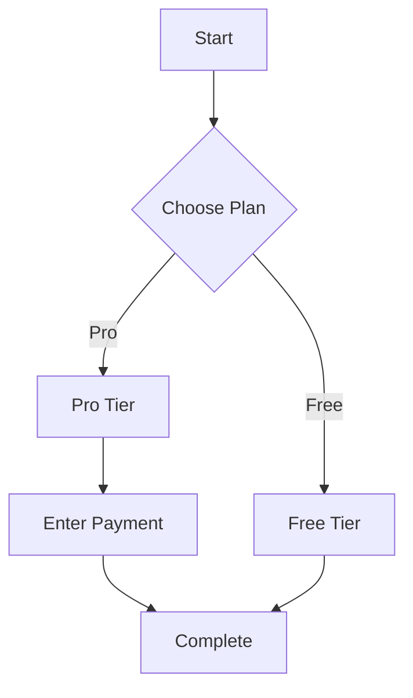
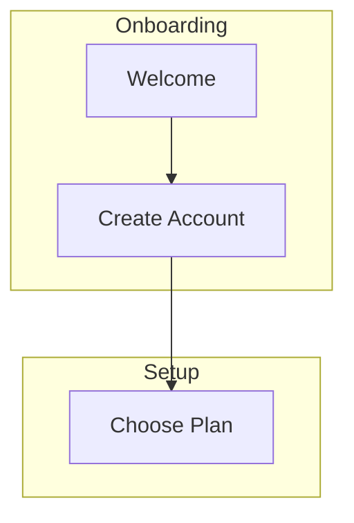

# Clive

**Flow visualization for Claude Code** — Miro in the terminal.

Clive runs side-by-side with Claude Code, rendering Mermaid flowcharts as ASCII diagrams in real-time. Design user flows visually while you code.

```
┌─ Claude Code ──────────────────────┬─ Clive ─────────────────────────────┐
│                                    │                                     │
│  You: Design a checkout flow       │  ┌──────────────┐                  │
│                                    │  │  View Cart    │                  │
│  Claude: I'll create that now...   │  └──────┬───────┘                  │
│                                    │         │                           │
│  > Created checkout.mmd            │    ╱────────╲                       │
│                                    │   ╱  Cart    ╲                      │
│                                    │  < Empty?     >                     │
│                                    │   ╲          ╱                      │
│                                    │    ╲────────╱                       │
│                                    │    Yes│    │No                      │
│                                    │       ▼    ▼                        │
│                                    │  ┌────────┐ ┌──────────────┐       │
│                                    │  │Continue │ │  Checkout    │       │
│                                    │  │Shopping │ │              │       │
│                                    │  └────────┘ └──────────────┘       │
└────────────────────────────────────┴─────────────────────────────────────┘
```

## Setup

```bash
git clone https://github.com/your-org/clive.git
cd clive
pnpm setup
```

That's it. `clive` is now available globally.

### Requirements

- Node.js >= 18
- pnpm
- tmux (for side-by-side mode; optional)

## Usage

```bash
cd your-project
clive
```

This launches a tmux session with Claude Code on the left and the diagram viewer on the right. Any `.mmd` or `.mermaid` files in your project are rendered automatically.

### Commands

| Command | Description |
|---------|-------------|
| `clive` | Launch full session (Claude + diagram viewer in tmux) |
| `clive auto` | Diagram viewer only (no tmux, no Claude) |
| `clive watch <file>` | Watch a specific `.mmd` file |
| `clive render <file>` | One-shot render to stdout |

### Keyboard Shortcuts (in diagram viewer)

- `q` — quit
- `Left/Right` arrows — switch between diagrams (when multiple `.mmd` files exist)

## How It Works

1. Run `clive` from your project directory
2. Claude Code opens alongside the diagram viewer
3. Ask Claude to design a flow — it creates a `.mmd` file
4. The diagram appears instantly in the viewer
5. Iterate — edits to the file update the diagram in real-time

## Mermaid Syntax

Clive uses standard [Mermaid flowchart syntax](https://mermaid.js.org/syntax/flowchart.html):



### Node Shapes

- `[text]` — Rectangle
- `{text}` — Diamond (decision)
- `([text])` — Stadium/pill
- `[[text]]` — Subroutine
- `[(text)]` — Cylinder (database)
- `((text))` — Circle

### Subgraphs



## Project Structure

```
clive/
├── packages/
│   ├── cli/          # CLI + TUI application (Ink/React)
│   ├── core/         # Parser, validator, layout engine
│   ├── renderer/     # ASCII diagram renderer
│   └── mcp-server/   # MCP tools for Claude Code
└── package.json
```

## License

MIT
